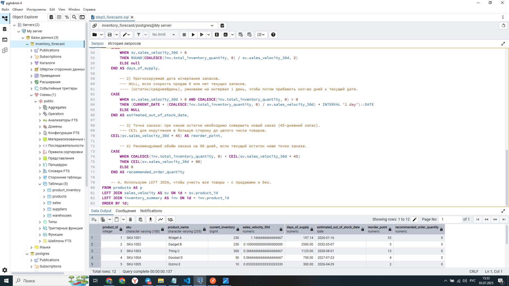

# Проект: Система прогнозирования закупок для E-commerce


---

## Описание Проекта

Этот проект представляет собой демонстрационную систему для **прогнозирования потребностей в закупках товаров**, разработанную для оптимизации управления запасами в e-commerce. Основная цель — помочь компаниям минимизировать потери от избыточных запасов и упущенных продаж из-за их отсутствия, предоставляя точные данные для принятия решений.

Как **системный аналитик**, я отвечал за полный цикл работы над проектом: от сбора и анализа требований до проектирования базы данных, реализации ключевой бизнес-логики с помощью SQL и разработки спецификации API. Этот проект демонстрирует мои навыки в:
* **Системном анализе и документировании** (BPMN, ERD, User Stories, Use Cases)
* **Проектировании реляционных баз данных** (PostgreSQL)
* **Разработке сложных SQL-запросов** для аналитических задач
* **Проектировании REST API** с использованием OpenAPI (Swagger) Specification
* **Анализе бизнес-процессов** и предложении решений на основе данных

---

## Аналитика и Проектирование

На этом этапе были определены бизнес-процессы, функциональные и нефункциональные требования, а также логическая структура системы.

### 1. Видение Проекта и Глоссарий

* **Vision (vision.md):** Краткое описание проблемы и цели проекта.
* **Глоссарий (glossary.md):** Определения ключевых терминов, используемых в предметной области, для обеспечения единого понимания.

### 2. Требования (requirements.md)

Документ `requirements.md` содержит детальные **функциональные** и **нефункциональные** требования, описанные в форматах **User Stories**, **Use Cases** и **Job Story**.

* **Пример User Story:**
    * "Как **Менеджер по закупкам**, я хочу **видеть подсчитанный объем заказа для каждого товара**, чтобы **быстро принимать решения о пополнении запасов**."
* **Пример Use Case:** "Расчет и отображение прогнозов по товару"
    * **Акторы:** Менеджер по закупкам, система.
    * **Основной поток:** Описан сценарий взаимодействия от запроса до получения прогноза.
    * **Альтернативные потоки:** Учтены ситуации, такие как отсутствие данных о продажах.
* **Пример Job Story:**
    * Когда я **вижу, что товар заканчивается**, я **хочу знать точный момент, когда нужно сделать заказ**, чтобы **избежать потери продаж**.

### 3. Моделирование Бизнес-Процессов (BPMN)

Бизнес-процесс "Планирование закупки товара" был смоделирован с использованием нотации **BPMN 2.0** в Stormbpmn. Диаграмма демонстрирует ключевые шаги процесса. Для данного pet-проекта, фокусируясь на потоке работ, диаграмма **упрощена без использования дорожек (Swimlanes)**.


### 4. Проектирование Базы Данных (ERD)

Логическая модель базы данных (ERD) была разработана для хранения информации о товарах, продажах, поставщиках и складских остатках. Использовались принципы нормализации для обеспечения целостности и эффективности данных.

Подробное описание структуры базы данных и обоснование проектных решений доступно по [ссылке](docs/er_explanation.md).


---

## Моделирование Данных и SQL-Логика

Этот раздел демонстрирует создание структуры базы данных и реализацию основной бизнес-логики с использованием SQL-запросов.

### 1. Схема Базы Данных (DDL)

Схема базы данных реализована в PostgreSQL. Все таблицы, их связи (PRIMARY KEY, FOREIGN KEY), ограничения (CHECK, UNIQUE) и типы данных определены в файле `db/schema.sql`.

* **Таблицы:** `suppliers`, `products`, `warehouses`, `sales`, `product_inventory`.
* **Особенности:** Использование `TIMESTAMPTZ` для учёта часовых поясов, `DECIMAL` для финансовых данных, `GENERATED ALWAYS AS` для вычисляемых полей.

### 2. Тестовые Данные

База данных была наполнена тестовыми данными с помощью SQL-скриптов `db/seed_data.sql` и `db/seed_data2.sql` для демонстрации функциональности системы.

### 3. Расчет Прогнозных Метрик (SQL)

Ключевая бизнес-логика системы реализована в виде сложного SQL-запроса, который рассчитывает следующие метрики для каждого товара:

* **Скорость продаж** за 30, 60 и 90 дней.
* **Текущий остаток** на складах.
* **Дни до исчерпания запасов** (`days_of_supply`).
* **Прогнозируемая дата исчерпания запасов** (`estimated_out_of_stock_date`).
* **Точка заказа** (`reorder_point`) — количество, при котором нужно сделать новый заказ.
* **Рекомендуемый объём заказа** (`recommended_order_quantity`) — объем, необходимый для покрытия потребностей на 90 дней, если текущий остаток ниже точки заказа.

За основу в текущем проекте взяты следущие параметры по-умолчанию:
* **Скорость продаж** рассчет за последние 30 дней.
* **Цель по возобновлению запасов** на 90 дней вперед.
* **Точка заказа** при 45-дневном остатке запаса.

Результат выполнения основного аналитического запроса (`db/step3_forecasts.sql`):


---

## Проектирование API (OpenAPI / Swagger)

Для обеспечения программного взаимодействия с системой прогнозирования был спроектирован REST API. Спецификация API полностью описана с использованием **OpenAPI Specification (Swagger)** в формате YAML.

### 1. Структура API

Файл `docs/api/openapi.yaml` содержит полное описание API, включая:
* **Общую информацию:** название, версия, описание API.
* **Серверы:** базовый URL для доступа к API.
* **Схемы данных (`components/schemas`):** Переиспользуемые JSON-модели для запросов и ответов (например, `ProductForecast`, `SaleInput`, `ErrorResponse`).
* **Эндпоинты (`paths`):** Детальное описание доступных ресурсов:
    * `GET /forecasts`: Получение списка всех прогнозов по товарам.
    * `GET /forecasts/{product_sku}`: Получение прогноза для конкретного товара по его SKU.
    * `POST /sales`: Имитация регистрации новой продажи (для демонстрации входящих данных).

Визуализация спецификации API в VS Code с помощью расширения "OpenAPI (Swagger) Editor":


### 2. Тестирование API (Postman)

Работоспособность и корректность структуры ответов API были проверены с использованием инструмента Postman.
Ниже представлен пример успешного GET-запроса к эндпоинту `/forecasts/{product_sku}`, демонстрирующий структуру ожидаемого ответа с прогнозными метриками.

.png)
---

## Технологический Стек

* **База данных:** PostgreSQL
* **Управление БД:** pgAdmin 4
* **Язык запросов:** SQL
* **Аналитика и Проектирование:** Draw.io (diagrams.net), Stormbpmn(stormbpmn.com)
* **Документирование API:** OpenAPI Specification (Swagger)
* **Редактор кода:** Visual Studio Code
* **Контроль версий:** Git, GitHub
* **Тестирование API:** Postman

---

## Как Запустить Проект Локально

Для запуска и изучения проекта на вашем локальном компьютере выполните следующие шаги:

1.  **Клонируйте репозиторий:**
    ```
    git clone [https://github.com/eugenetru/inventory-forecast-system.git](https://github.com/eugenetru/inventory-forecast-system.git)
    cd inventory-forecast-system
    ```
    2.  **Настройте PostgreSQL:**
    * Убедитесь, что у вас запущен PostgreSQL и pgAdmin 4.
    * Создайте новую базу данных (например, `inventory_forecast_db`) в pgAdmin 4.

3.  **Создайте схему и наполните данные:**
    * Откройте `pgAdmin 4`, подключитесь к созданной базе данных.
    * Откройте Query Tool.
    * Выполните SQL-скрипт `db/schema.sql` для создания всех таблиц.
    * Выполните SQL-скрипт `db/seed_data.sql` для наполнения таблиц тестовыми данными.

4.  **Протестируйте SQL-логику:**
    * В том же Query Tool выполните скрипт `db/step3_forecasts.sql`, чтобы увидеть результаты прогнозных расчетов.

5.  **Изучите спецификацию API:**
    * Откройте файл `docs/api/openapi.yaml` в "OpenAPI (Swagger) Editor" для просмотра интерактивной документации API.

---

## Демонстрация Проекта (Видео)

Посмотрите короткое видео, демонстрирующее основные артефакты проекта и его функциональность:

[Демонстрация системы прогнозирования закупок](ВСТАВЛЮ ПОЗЖЕ)
В видео вы увидите:
* Структуру файлов проекта.
* Созданные диаграммы BPMN и ERD.
* OpenAPI спецификацию API в VS Code.
* Пример GET-запроса к API в Postman.
* Выполнение сложного SQL-скрипта в pgAdmin 4 с отображением прогнозных метрик.

---

## Контакты

Евгений Трусов
* Telegram: @eugenebfs
* Email: eugenetru@mail.ru